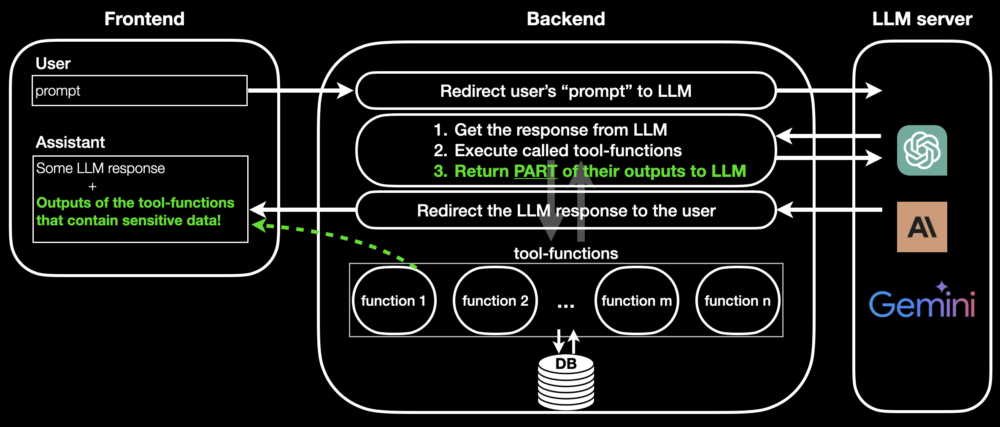
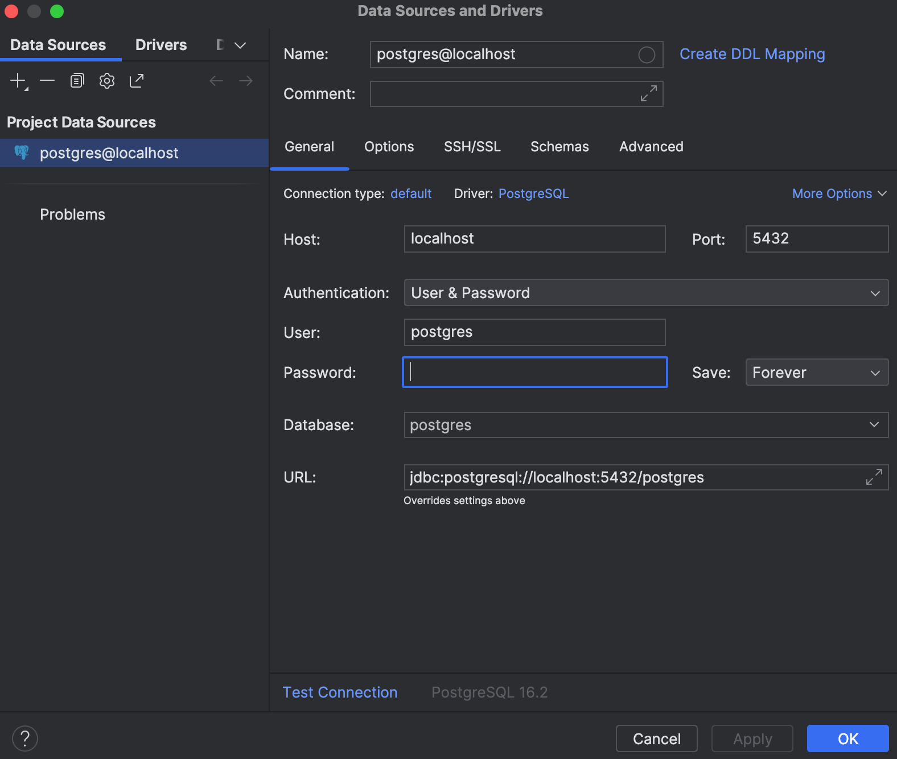

# UAIssistant

UAIssistant is an Assistant (Backend) powered by OpenAI's ChatGPT, Anthropic Claude and Google's Gemini, that enhances **Data Security** and optimizes **Money** and **Time** costs.

[UAIssistant-FE](https://github.com/uhatikus/UAIssistant-FE) - Frontend for the UAIssistant Backend.



## Contents

- [Requirements](#requirements)
  - [python](#install-python)
  - [poetry](#install-poetry)
  - [docker](#install-docker)
- [Install and Run](#install-and-run)
  - [Set env variables](#set-env-variables)
  - [Run locally (dev)](#run-locally-dev)
  - [Run with docker (prod)](#run-with-docker-prod)
- [How to use](#how-to-use)
  - [1. Swagger docs](#1-swagger-docs)
  - [2. UAIssistant-FE](#2-uaissistant-fe)
- [Tool-functions Development](#tool-functions-development)
- [Add LLM](#add-llm)
- [DB Access](#db-access)
- [Acknowledgement](#acknowledgement)

## Requirements

- Python (~3.10)
- Poetry
- Docker

### Install Python

For Linux users: `sudo apt install python3.10`

For MacOS users: `brew install python@3.10`

Otherwise, please, go to the official [Python website](https://www.python.org/downloads/), download and install Python `python3.10`.

### Install Poetry

Install poetry by following instructions from the official [poetry website](https://python-poetry.org/docs/).

If you would like to build your own project with poetry, you can follow the instructions from the offical [poetry website](https://python-poetry.org/docs/basic-usage/).

### Install Docker

There are several ways to install docker:

- [Docker](https://docs.docker.com/engine/install/)
- [Rancher Desktop](https://rancherdesktop.io/) (good option for MacOS)
- [Podman](https://podman.io/)

`docker-compose` is also required. Check if you have `docker-compose` with the command `docker-compose --version`. If you don't have it, please, following the guides: [for Linux](https://docs.docker.com/compose/install/linux/) and [for MacOS](https://www.ionos.com/digitalguide/server/configuration/docker-compose-on-mac/):

## Install and Run

Clone the repository:

```
git clone git@github.com:uhatikus/UAIssistant.git
cd UAIssistant
```

### Set env variables

1. Create `.env` file and copy the content of `.env.example` to `.env`: `cp .env.example .env`. You can use your DB env variables.
2. Set your LLMs API KEY-s:

- OPENAI_API_KEY: [get open-ai API key](https://platform.openai.com/api-keys),
- ANTHROPIC_API_KEY: [get anthropic API key](https://console.anthropic.com/settings/keys)
- GEMINI_API_KEY: [get gemini API key](https://aistudio.google.com/app/apikey) (available only from certain locations like US, VPN can resolve your issues).

### Run locally (dev)

1. Create postgres db in docker:

```
make initdb
```

2. Install poetry dependencies:

```
make install
```

3. Start the BE:

```
make run
```

- if you would like to restart the db

```
make startdb
```

- if you would like to stop the db

```
make stopdb
```

- if you would like to clean the db

```
make cleandb
```

### Run with Docker (prod)

Build and start the dockers for db and UAIssistant-BE application with docker-compose:

```
docker-compose up --build
```

Remove `--build` if you already have built the docker containers.

Remove the created containers:

```
docker-compose down
```

## How to use

### 1. Swagger docs

Open [Swagger documentation](http://0.0.0.0:8000/docs#/) and perform the requests.

### 2. UAIssistant FE

Start [UAIssistant-FE](https://github.com/uhatikus/UAIssistant-FE) and play around with the APIs via intuitive UI.

## Tool-functions Development

[Readme "How to develop tool-funtions"](uaissistant/tool_factory/README.md)

## Add LLM

[Readme "How to add LLM"](uaissistant/llms/README.md)

## DB Access

Access the DB with DataGrip or DBveaver. Use the details from `.env` file.

DataGrip example:


## Acknowledgment

I would like to express my sincere gratitude to everyone who made this project possible:

- [Simon Dae Oong Kim](https://www.linkedin.com/in/simondkim/)
- [Terry (심탁길) Shim](https://www.linkedin.com/in/terry-shim-82660a50/)
- [Hyeonsoo (David) Lee](https://www.linkedin.com/in/civilizeddev/)
- [Aidyn Aluadin](https://www.linkedin.com/in/aaidyn/)
- [Shyngys Aitkazinov](https://www.linkedin.com/in/shyngys-aitkazinov-00496b193/)
- [Gaukhar Alina](https://www.linkedin.com/in/gaukhar-alina/)
